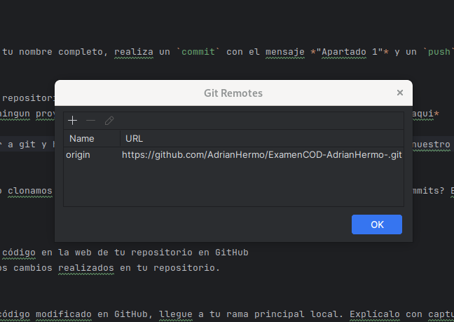
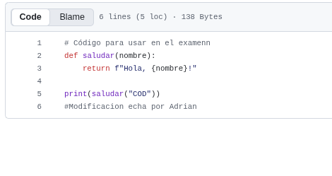
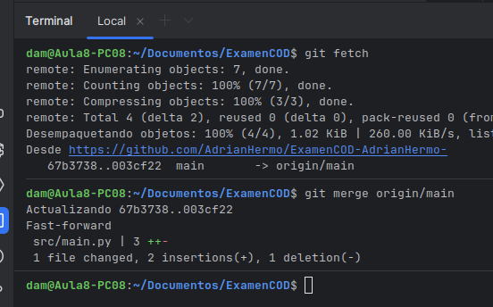
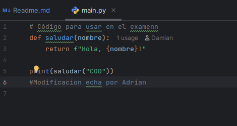
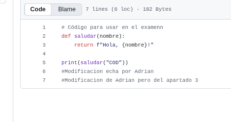
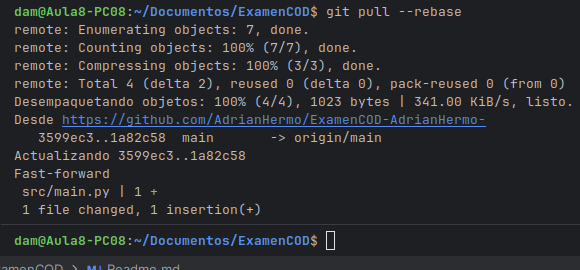

# Examen 1ª Evaluación (2ª Parte) - Control de Versiones

---

## Instrucciones
- Los commits de cada apartado deben tener el mensaje *"Apartado X - descripción del cambio realizado"*
- Entrega en la tarea de Moodle tu repositorio
- Solo se corrigen los commits que estén en el repositorio remoto

### Apartado 1

- Clona este repositorio.
- Modifica este Readme, poniendo tu nombre completo, realiza un `commit` con el mensaje *"Apartado 1"* y un `push`.

Adrian Hermo Abalde

Pregunta 
- ¿Qué paso es fundamental cuando clonamos un repositorio ajeno para que podamos subir nuestros propios commits? Explícalo y utiliza capturas de pantalla.

- *-Para empezar debemos clonar el repositorio copiando la URL
y cuando abrimos el pycharm sin ningun proyecto ya nos sale una opcion de clone repository conjcretamente aqui*

Para cambiar el remoto debemos ir a git y hasta el apartado de manage remote y ahi justo cambiarlo por el nuestro

### Apartado 2

- Realiza una modificación en el código en la web de tu repositorio en GitHub
- Utiliza fetch para descargar los cambios realizados en tu repositorio.

Pregunta
- Explica los pasos para que el código modificado en GitHub, llegue a tu rama principal local. Explícalo con capturas de pantalla.

Para este paso simplemente modificamos el main desde el github y ponemos un comenatario por ejemplo en mi caso puse eso

Y luego para que salga en nuestro pycharm en main.py debemos irnos al terminal y hacer los siguientes comandos
(git fetch y despues git merge origin/main)

- 
- 
Y nos saldria algo tal que asi 

### Apartado 3

- Realiza otro cambio desde la web de tu repositorio en GitHub.
- Utiliza pull para descargar los cambios realizados en tu repositorio.

Pregunta
- Explica los pasos dados para que el cambio realizado en GitHub, llegue a tu rama principal local. Explícalo con capturas de pantalla.

Hacemos otra vez un cambio en el programa main como en el ejercicio anterior

Y a continuacion vamos al terminal en main y debemos colocar los siguientes comando(git pull --rebase)

Y nos saldra nuestra modificacion hecha en el pycharm
